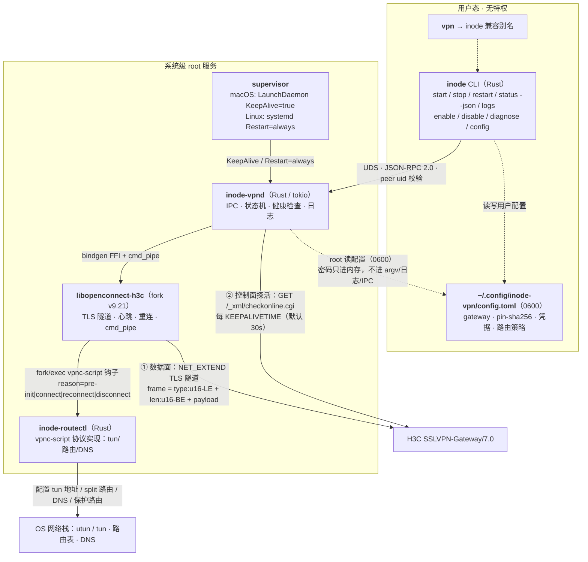
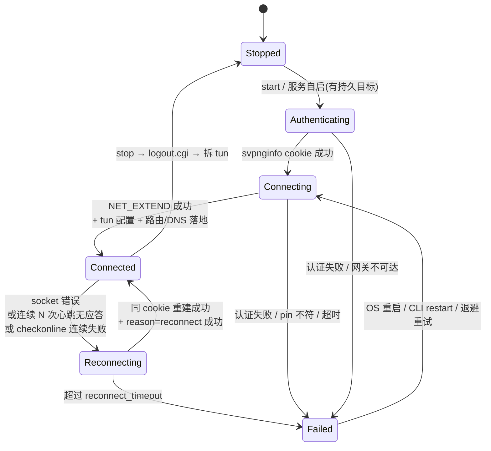

# inode-vpn 架构设计 v1.0（定稿）

> 状态：已定稿
> 范围：H3C SSL VPN 客户端 CLI + 持久化服务，跨 macOS / Linux
> 前置结论：本设计全部基于实测抓包与协议探针，见附录 A「H3C 协议事实」。

---

## 1. 决策记录（ADR）

| ID | 决策 | 理由 |
|---|---|---|
| D1 | 语言：Rust | 高抽象、跨平台、单二进制、适合 FFI + 系统编程 |
| D2 | 引擎模式：直接链接 `libopenconnect-h3c`（引擎 B） | 状态机、日志、保活、重连都在进程内可控，不解析子进程日志 |
| D3 | fork 基线：upstream openconnect v9.21 + 移植 `h3c.c` | 现代基线，协议缺口由我们自己补 |
| D4 | 持久化：Linux `systemd` system unit；macOS root `LaunchDaemon` | 开机/掉线自愈由 OS 负责，不自造 watchdog |
| D5 | 判活：会话事件 + 隧道心跳(type=2) + `checkonline.cgi`；**不用 ping** | ping 依赖内网策略，checkonline/心跳是网关原生协议 |
| D6 | 凭据：`~/.config/inode-vpn/config.toml` 0600 过渡；兼容 `.auth` 迁移 | 不引入 keychain 依赖，先满足安全底线 |
| D7 | 打包：Nix flake | 与现有工作流一致，稳定 gc-root 解决 store GC |
| D8 | 路由/DNS：`inode-routectl` 替代 vpnc-script | vpnc-script 协议保留，实现收归 Rust |
| D9 | IPC：Unix Domain Socket + JSON-RPC 2.0 + peer uid 校验 | 低延迟、跨平台、无需网络暴露 |
| D10 | 证书 pin：沿用 openconnect `pin-sha256`（**SPKI 哈希**）语义 | 实测确认 `pin-sha256` 不是证书 DER 哈希，不能混用 |

---

## 2. 目标与非目标

### 目标

1. 一个 CLI（`inode`）在 macOS 与 Linux 上提供一致的 `start/stop/restart/status/logs/enable/disable/diagnose` 体验。
2. 一个 root daemon（`inode-vpnd`）持有唯一 VPN 会话，状态机可观测、可查询、可订阅。
3. 系统级持久化：开机拉起、掉线自愈、换网重连，不依赖终端会话。
4. H3C 协议完整实现：登录、`NET_EXTEND`、数据面组帧、**type=2 心跳**、断线重连、logout。
5. 路由策略安全：VPN 路由永不切断管理面（SSH/局域网），并正确下发 split routes 与 DNS。

### 非目标（v1）

- GUI / 菜单栏 / 状态栏。
- 多用户并发配置、多 VPN profile。
- DTLS/ESP（当前 H3C 只用 TLS 数据面）。
- IPv6 隧道。
- SELinux / AppArmor 策略（SELinux 当前关闭）。
- Apple Privileged Helper Tool 签名体系（未来增强项）。

---

## 3. 总体架构



---

## 4. 组件设计

### 4.1 `inode`（用户态 CLI）

- 纯客户端：只做参数解析、UDS 调用、输出格式化、服务安装。
- 不碰 tun/路由，不读密码（`status`、`logs`、`diagnose` 均不回显密码/cookie）。
- 子命令：

| 命令 | 行为 |
|---|---|
| `inode start [--config PATH]` | 确保 daemon 存在（未启动则拉起），请求连接 |
| `inode stop` | 会话注销 → 拆 tun → 删除服务状态目标 |
| `inode restart` | stop + start |
| `inode status [--json]` | 状态快照；退出码 `0=Connected / 3=Stopped / 1=Failed/其他` |
| `inode status --watch` | 订阅状态流 |
| `inode logs [-f] [--level]` | 读取/订阅 daemon 日志（journald 或文件） |
| `inode enable [--now]` | 安装/启用系统服务；`--now` 同时 start |
| `inode disable [--now]` | 停用/卸载系统服务 |
| `inode config show / set / migrate` | 配置管理；`migrate` 从旧 `.auth` 迁移 |
| `inode diagnose` | 生成脱敏诊断包（路由、utun、unit 状态、最近事件；不含密码/cookie） |
| `inode discover-cert` | TOFU 获取网关 `pin-sha256`（SPKI）并写回配置 |

### 4.2 `inode-vpnd`（root daemon）

职责：

1. **进程生命周期**：被 systemd/launchd 拉起；崩溃后由 OS 重启；启动时加载 `state.json` 判断是否需自动重连。
2. **状态机**：唯一真相源（见 §5）。
3. **IPC server**：JSON-RPC 2.0 over UDS，见 §6。
4. **引擎线程**：通过 FFI 调用 libopenconnect：
   ```
   vpninfo_new(validate_cert_cb, auth_form_cb, privdata)
     → set_protocol("h3c")
     → parse_url(gateway)
     → set_cookie / obtain_cookie（密码仅经 auth form 回调注入）
     → make_cstp_connection()     // NET_EXTEND，解析 IP/ROUTES/DNS/KEEPALIVETIME
     → setup_tun_device(routectl, ifname)
     → openconnect_mainloop(reconnect_timeout, interval)   // 阻塞引擎线程
     → teardown（logout.cgi + reason=disconnect）
   ```
5. **健康检查 task**：每 `KEEPALIVETIME` 秒独立 TLS 调 `checkonline.cgi`；连续失败计入 `Degraded/Reconnecting` 信号，不直接杀会话。
6. **日志**：结构化事件 + 滚动文件（macOS）/ journald（Linux）；密码与 cookie 在入口统一脱敏。
7. **崩溃恢复**：`state.json` 记录目标配置路径与期望状态；`Restart=always`/`KeepAlive` 后自动恢复。

### 4.3 `libopenconnect-h3c`（自己的 fork）

基线：upstream openconnect **v9.21**，从 MR!397 移植 `h3c.c` 并做以下增强（详见 §9）：

- 完整组帧状态机（多帧/半帧/未知帧）。
- type=2 心跳发送与 `02 02 00 00` 应答识别。
- 读/写错误 → 同一 cookie 重连（新 TLS + `NET_EXTEND` + `reason=reconnect`）。
- 解析 `DNS / GATEWAY / RESTRICT / KEEPALIVETIME`。
- daemon 集成 API：`openconnect_h3c_set_drop_uid()`、结构化事件回调、日志脱敏回调。
- 保留 100% CPU 忙循环修复。

### 4.4 `inode-routectl`（vpnc-script 替代）

- 兼容 vpnc-script 环境变量协议，只认 `reason` 四个阶段。
- `connect / reconnect`：
  1. 配置 tun 地址与 MTU（macOS: `utunN`；Linux: `/dev/net/tun`）。
  2. 添加 **VPN 网关主机路由**到物理网关（socket 存活前提）。
  3. 下发 `CISCO_SPLIT_INC_*`（来自 H3C `ROUTES` 头）。
  4. **保护路由**：自动识别物理接口所在前缀，添加比 VPN 路由更精确的路由，保证 SSH/局域网不丢。
  5. DNS：按配置应用/忽略服务器 DNS。
- `disconnect`：精确撤销本会话添加的条目（以 `state.json` 记账，不全局 flush）。
- Linux 用 rtnetlink（Rust `rtnetlink` crate）；macOS 用 `route/scutil` 命令等价实现。

---

## 5. 状态机



状态机字段（`status --json` schema）：

```json
{
  "state": "Connected",
  "since": "2026-08-26T11:00:00Z",
  "gateway": "<host>:<port>",
  "session": {
    "ip": "10.1.1.20",
    "mtu": 1400,
    "routes": ["192.168.0.0/18"],
    "dns": ["<DNS1>", "<DNS2>"],
    "keepalive": 30
  },
  "stats": {"tx_pkts": 0, "tx_bytes": 0, "rx_pkts": 0, "rx_bytes": 0},
  "last_error": null,
  "service": {"supervisor": "launchd", "enabled": true, "autostart": true}
}
```

---

## 6. IPC 契约

### 6.1 传输

| 平台 | socket 路径 | 权限 |
|---|---|---|
| Linux | `/run/inode-vpn/<uid>/daemon.sock` | 父目录 0755（systemd `RuntimeDirectoryMode`）；socket 0666 |
| macOS | `/var/run/inode-vpn/<uid>/daemon.sock` | 父目录 0755（LaunchDaemon 创建）；socket 0666 |

- 协议：newline-delimited JSON-RPC 2.0。
- socket 对全系统可 connect（0666）以便目标用户访问；真正的门禁是连接建立后的 peer 校验。
- 服务端校验：Linux `SO_PEERCRED` 的 uid；macOS `getpeereid()`。只接受 uid == 目标用户或 root。
- CLI 不连接时 daemon 照常运行；socket 是管理面，不是数据面。

### 6.2 方法

| 方法 | 参数 | 返回 |
|---|---|---|
| `ping` | — | `pong` + 版本 |
| `start` | 可选 config path | 接受/拒绝；状态经事件推送 |
| `stop` | — | 同上 |
| `restart` | — | 同上 |
| `status` | — | 状态快照 |
| `subscribe` | 事件类型过滤 | 事件流 |
| `logs` | 行数/级别/时间窗 | 日志行 |
| `diagnose` | — | 脱敏诊断包摘要 |

事件：`state_changed`、`session_updated`、`stats`、`log`、`error`。

---

## 7. 配置与凭据

路径：`~/.config/inode-vpn/config.toml`，文件必须 0600，否则 daemon 拒绝启动。

```toml
[gateway]
url = "<GATEWAY_HOST>:<PORT>"          # 与 .auth gateway 同语义
servercert = "pin-sha256:..."           # SPKI 哈希；可留空首次 discover-cert

[credentials]
username = "..."
password = "..."

[network]
# 保活：缺省 auto = 使用 NET_EXTEND 的 KEEPALIVETIME；可显式覆盖
keepalive = "auto"
# 额外保护网段（比 VPN 路由更精确，保证可达）；缺省自动识别物理前缀
preserve_cidrs = []
# server = 应用 VPN DNS；ignore = 保持本机 DNS；fallback = VPN DNS 不可达时回退
dns = "server"

[service]
autostart = true          # 开机自动恢复
restart_delay = 10        # 失败重试间隔（秒）
```

迁移：`inode config migrate` 读旧 `.auth`（`username/password/gateway/servercert/ping_target`），写入 0600 TOML 并提示删除 `.auth`；旧 `vpn` 命令保留为 `inode` 别名一个过渡版本。

安全规则：

- 密码只存在于配置文件和 libopenconnect auth-form 内存中。
- 不进入 argv、环境变量、日志、IPC 响应、diagnose 包。
- cookie 同规则：日志/IPC 一律打码。

---

## 8. 判活与保活（三层信号）

| 层 | 机制 | 触发条件 | 动作 |
|---|---|---|---|
| 1. 隧道心跳（主） | 客户端发 `02 00 00 00`；服务器应回 `02 02 00 00` | 距上次 TX 超过 `KEEPALIVETIME`（默认 30s） | 连续 N=3 次无应答 → `Reconnecting` |
| 2. 会话事件（主） | libopenconnect 回调/socket 错误 | read/write 失败、`NET_EXTEND` 失败、logout | 驱动状态机迁移 |
| 3. checkonline（控制面） | daemon 独立 TLS `GET /_xml/checkonline.cgi`，带 `svpnginfo` cookie | 每 `KEEPALIVETIME` 秒 | 连续失败 → `Degraded`，与层 1 叠加判定 |
| ~~ping~~ | **删除** | — | 内网禁 ping 曾造成误杀，不再使用 |

`Connected` 定义：**tun/路由已配置 + 隧道建立 + 心跳链路可用 + checkonline 在线**。

---

## 9. 平台服务化

### 9.1 Linux（现代 Linux，systemd）

`inode enable` 生成实例 unit（`%i = uid`）：

```ini
# /etc/systemd/system/inode-vpnd@<uid>.service
[Unit]
Description=inode-vpn daemon (user <uid>)
Wants=network-online.target
After=network-online.target

[Service]
Type=simple
User=<uid>
Group=<uid>
ExecStart=/var/lib/inode-vpn/current/bin/inode-vpnd --uid <uid>
RuntimeDirectory=inode-vpn
RuntimeDirectoryMode=0755
Restart=always
RestartSec=5
LimitNOFILE=65536
CapabilityBoundingSet=CAP_NET_ADMIN CAP_SETUID CAP_SETGID
AmbientCapabilities=CAP_NET_ADMIN CAP_SETUID CAP_SETGID
NoNewPrivileges=yes
UMask=0077
PrivateTmp=yes
ProtectSystem=strict
ProtectHome=read-only
ProtectKernelTunables=yes
ProtectKernelModules=yes
ProtectKernelLogs=yes
ProtectControlGroups=yes
ProtectClock=yes
ProtectHostname=yes
LockPersonality=yes
RestrictNamespaces=yes
RestrictRealtime=yes
RestrictSUIDSGID=yes
ReadWritePaths=/run/inode-vpn

[Install]
WantedBy=multi-user.target
```

要点：

- 服务以**目标用户**身份运行，通过 `AmbientCapabilities` 只授 `CAP_NET_ADMIN/CAP_SETUID/CAP_SETGID`，无需 DAC bypass 去读用户 0600 配置。
- ExecStart 指向 **stable gc-root 符号链接**，绝不写 `/nix/store/...hash`。
- `enable` 同时注册真正的 Nix gc-root：`/nix/var/nix/gcroots/inode-vpn-<uid> -> <package>`；`nix-collect-garbage` 后 `current` 目标仍存活。
- 日志走 journald；`inode logs` 转 `journalctl -u inode-vpnd@<uid>`。
- daemon 用 rtnetlink 监听物理接口 link/addr 事件（忽略 tun/lo），作为重连触发器。

### 9.2 macOS（launchd）

`sudo inode enable` 安装：

```xml
<!-- /Library/LaunchDaemons/cc.inode.vpn-daemon.plist -->
<dict>
  <key>Label</key><string>cc.inode.vpn-daemon</string>
  <key>ProgramArguments</key>
  <array>
    <string>/var/lib/inode-vpn/current/bin/inode-vpnd</string>
    <string>--uid</string><string>501</string>
  </array>
  <key>RunAtLoad</key><true/>
  <key>KeepAlive</key><true/>
  <key>StandardOutPath</key><string>/var/log/inode-vpn.log</string>
  <key>StandardErrorPath</key><string>/var/log/inode-vpn.err</string>
</dict>
```

要点：

- root LaunchDaemon 开机即服务；CLI 以用户身份经 UDS 通信。
- daemon 监听 SystemConfiguration 网络变化，作为重连触发。
- 后续增强（非 v1）：拆成 LaunchAgent + 签名 Privileged Helper。

---

## 10. fork 工作清单（Phase 0）

1. 在 v9.21 上重建 `h3c.c`（`h3c_obtain_cookie / h3c_connect / h3c_bye / h3c_mainloop`）。
2. 数据面组帧状态机：流式解析 `type:u16-LE + len:u16-BE + payload`，处理多帧合并、半帧、非 1 帧。
3. 心跳：无 TX 超过 `KEEPALIVETIME` 时发 `02 00 00 00`；识别 `02 02 00 00`；心跳失败计数。
4. 重连：socket 错误 → 新 TLS → 同 `svpnginfo` cookie 重发 `NET_EXTEND` → `reason=reconnect` → 恢复；失败按 `reconnect_timeout` 退避后上报。
5. 头解析：`IPADDRESS/SUBNETMASK/ROUTES/DNS/GATEWAY/RESTRICT/KEEPALIVETIME` 全量入 `ip_info/cstp_options`。
6. daemon 集成 API：drop-uid、结构化事件、日志脱敏回调、`protect_socket_handler`。
7. 保留忙循环修复；补 golden tests（用附录 A 的抓包/探针做回归基线）。

---

## 11. 打包（Nix flake）

```
packages
├── inode                 # workspace 单包：inode CLI + inode-vpnd + inode-routectl
├── inode-openconnect     # 自己的 libopenconnect-h3c fork（v9.21）
└── default = inode

nixosModules.inode-vpn   # 可选：NixOS module
```

- 服务安装命令创建 `/var/lib/inode-vpn/current` 稳定链接，并注册 `/nix/var/nix/gcroots/inode-vpn-<uid>`；unit/plist 只引用 `current`。
- dev shell 保持旧习惯：`inode` 与兼容的 `vpn` 均可用。
- CI 目标：`x86_64-linux`、`aarch64-linux`、`aarch64-darwin`、`x86_64-darwin`。

---

## 12. 安全模型

- daemon 以目标用户运行，仅 ambient `CAP_NET_ADMIN/CAP_SETUID/CAP_SETGID`；systemd sandbox（ProtectSystem=strict、ProtectHome=read-only、内核保护项等）进一步收敛。
- 会话建立后经 fork 的 `drop-uid` 降到目标用户，数据面不保留多余权限。
- 管理 socket 0666 可 connect，真正的门禁是 SO_PEERCRED/getpeereid：仅接受目标 uid 或 root；父目录 0755。
- 密码/cookie 脱敏清单在日志层统一执行，diagnose 强制二次过滤。
- 证书：TOFU 记录 `pin-sha256`（SPKI），pin 变化必须显式确认。

---

## 13. 失败模式与恢复

| 失败 | 检测 | 恢复 |
|---|---|---|
| 认证失败/密码错误 | libopenconnect 返回 | `Failed`，CLI 给出可读原因，不无限重试 |
| pin 不匹配 | 证书校验回调 | `Failed`，提示 `inode config migrate/discover-cert` |
| 隧道静默断 | 心跳无应答 / socket 错误 | fork 重连 → 失败则 OS 重启 daemon |
| 换网（DHCP/路由变化） | rtnetlink / SCNetwork | `reason=reconnect` + 重挂保护路由 |
| daemon 崩溃 | systemd/launchd | `Restart=always`/`KeepAlive`；读 `state.json` 恢复 |
| 路由泄漏（异常退出） | routectl 记账 | 下次启动与 disconnect 精确撤销 |

---

## 14. 实现阶段（v1.0 已完成）

> 以下阶段均已实现并通过验收；当前只剩 24h soak 与发布动作。

| 阶段 | 内容 | 验收 |
|---|---|---|
| Phase 0 | fork v9.21 + h3c 移植 + 组帧/心跳/重连 + API | golden 抓包回放通过；type=2 心跳闭环 |
| Phase 1 | Linux：daemon + CLI + systemd + routectl | 断网/拔线自愈，SSH 不断，journald 可查 |
| Phase 2 | macOS：LaunchDaemon + SCNetwork + routectl | 合盖唤醒/换网自愈，utun 路由正确 |
| Phase 3 | 安全收敛、diagnose、多平台 CI、文档 | `inode diagnose` 脱敏通过审计 |

---

## 15. 遗留开放项（不阻塞 v1）

1. `RESTRICT: 0` 的精确语义（影响 full-tunnel/split 判定）——需 iNode 原版或网关文档对照。
2. `login_challenge.cgi` 挑战流程（短信/二次认证）——当前网关未启用。
3. 服务器心跳应答 `02 02` 第二字节是否含序号/状态位——当前一一应答已满足保活，无需深究。
4. 多用户 / 多 profile、IPv6、DTLS——v2 候选。

---

# 附录 A：H3C 协议事实（实测基线）

> 来源：本机 `--dump-http-traffic` 抓包、`-S` script-tun 抓包、tcpdump + SSLKEYLOGFILE 解密、直接 TLS 协议探针。以下不包含任何密码/cookie 值。

## A.1 控制面

1. TLS 1.3 连接 `<GATEWAY>:<PORT>`；证书为自签名 `CN=HTTPS-Self-Signed-Certificate-...`；pin 用 **SPKI SHA256**。
2. `GET /svpn/index.cgi`，UA `SSLVPN-Client/3.0`
   → `302`，`Location-Action: Connection`，`Location: /client_getinfo.cgi`。
3. `GET /client_getinfo.cgi`，UA `SSLVPN-Client/7.0`
   → `200 chunked`，XML `<gatewayinfo>` 给出：
   - `<login>/_xml/login.cgi</login>`
   - `<logout>/_xml/logout.cgi</logout>`
   - `<checkonline>/_xml/checkonline.cgi</checkonline>`
   - `<challenge>/_xml/login_challenge.cgi</challenge>`
4. `POST /_xml/login.cgi`，`Content-Type: application/x-www-form-urlencoded`，`X-Pad: 000`，body：
   ```
   request=<urlencoded(<data><username>…</username><password>…</password></data>\r\n)>
   ```
   → `200 chunked`，`<result>Success</result>`，`Set-Cookie: svpnginfo=…`。
5. `NET_EXTEND / HTTP/1.1`（同一条 TLS，带 `Cookie: svpnginfo=…`）
   → `200`，响应头：

| 头 | 示例 | 说明 |
|---|---|---|
| `IPADDRESS` | `10.1.1.20` | 隧道内 IPv4 |
| `SUBNETMASK` | `24` | 前缀长度 |
| `ROUTES` | `192.168.0.0/18` | 分号分隔 split includes |
| `DNS` | `<DNS1>;<DNS2>` | v1 fork 必须解析下发 |
| `GATEWAY` | `10.1.1.100` | 隧道内网关；也是可用探针（但 v1 不依赖） |
| `RESTRICT` | `0` | 语义开放 |
| `KEEPALIVETIME` | `30` | 心跳间隔（秒） |

6. `GET /_xml/checkonline.cgi` + 有效 cookie → `200` 空 body；无效 cookie → TLS 连接被直接关闭。
7. `GET /_xml/logout.cgi` + cookie → `200` 空 body（独立新 TLS 连接调用）。

## A.2 数据面

- `NET_EXTEND` 后，同一条 TLS 流承载 IP 包。
- 帧格式：

```text
+--------+--------+----------...---+
| type   | len    | payload        |
| u16 LE | u16 BE | len 字节       |
+--------+--------+----------...---+
```

- `type=1`：IPv4 数据包（MTU 1400）。
- `type=2`：**心跳**。客户端发送 `02 00 | 00 00`；服务器应答 `02 02 | 00 00`。
- 其他 type（0/3/4/5/6）实测被服务器静默忽略。
- 一条 TLS record 可能包含多帧或半帧，解析必须是流式状态机。

## A.3 官方依据

H3C 命令手册：`ip-tunnel keepalive` 默认 30s；保活报文由客户端发送；`timeout idle` 内既无数据也无保活则网关断开会话。与实测 `KEEPALIVETIME: 30` 和 type=2 心跳吻合。

---

# 附录 B：诊断产物索引

- 脱敏控制面抓包：会话内临时文件（已清理原件）。
- TLS 解密验证：`data.data` 明文确认 `NET_EXTEND` 与 `01 00 | 00 27 | 45 00...` 数据帧。
- 心跳矩阵：`type=2` 每发必答 `02 02 00 00`，其余 type 无响应。

> 含密钥/明文 cookie 的 pcap 与 keylog 属敏感文件，分析完成后立即删除，不留入仓库。
